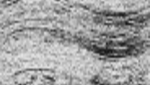

# Image Processing API - Challenge 2 Solution

A production-grade imaging system that processes CSV image data, stores it efficiently in TileDB, and provides a REST API for querying image frames by depth ranges with custom Imagecolormaps.


### Core Requirements Met:

| Requirement | Status | Implementation |
|-------------|--------|----------------|
| **Resize images from 200px to 150px width** | ✅ | SciPy variance-preserving resizing with order=3 interpolation |
| **Store resized images in database** | ✅ | 3D TileDB arrays with ZSTD compression and optimized tiling |
| **API for depth-based frame queries** | ✅ | FastAPI with `/frames` endpoints supporting depth_min/depth_max |
| **Apply custom colormap to frames** | ✅ | Imageblue-to-red colormap with proper NaN handling |
| **Python-based solution** | ✅ | Pure Python with NumPy, SciPy, FastAPI, and TileDB |
| **Containerized solution** | ✅ | Docker Compose with optimized multi-stage builds |

##  Going The Extra Mile - Automated Data Pipeline

Beyond the core requirements, this solution includes a **production-grade automated data pipeline**:

###  Automated Pipeline Features:
- **Real-time File Monitoring**: Automatically detects new CSV files in the `data/` directory
- **Data Validation**: Comprehensive CSV structure and quality validation
- **Error Handling**: Failed files moved to `data/failed/` with detailed error logs
- **Success Management**: Processed files moved to `data/processed/`
- **Status Tracking**: Complete processing history via API endpoints
- **Pipeline Control**: Start/stop/scan operations through REST API


##  Architecture

```
┌─────────────────┐    ┌─────────────────┐    ┌─────────────────┐
│   CSV Files     │───▶│  Auto Pipeline  │───▶│   TileDB 3D     │
│   (200x depth)  │    │  File Monitor   │    │   Arrays        │
└─────────────────┘    └─────────────────┘    └─────────────────┘
                              │                        │
                              ▼                        ▼
┌─────────────────┐    ┌─────────────────┐    ┌─────────────────┐
│   Error Logs    │◀───│   Validation    │    │   FastAPI       │
│   data/failed/  │    │   & Processing  │    │   REST API      │
└─────────────────┘    └─────────────────┘    └─────────────────┘
                              │                        │
                              ▼                        ▼
┌─────────────────┐    ┌─────────────────┐    ┌─────────────────┐
│  Success Files  │◀───│  150px Resized  │    │  Colormap       │
│ data/processed/ │    │  Image Data     │    │  Application    │
└─────────────────┘    └─────────────────┘    └─────────────────┘
```

##  Quick Start

### Option 1: Automated Pipeline (Recommended)
```bash
# Start the API service with integrated pipeline
docker-compose up -d image-api

# Start automated file monitoring
curl -X POST http://localhost:8000/pipeline/start

# Add CSV files to data/ directory - they'll be processed automatically
cp your_survey.csv data/

# Check processing status
curl http://localhost:8000/pipeline/status
```

### Option 2: Manual Processing
```bash
# Process data manually
docker-compose up data-ingestion

# Start API
docker-compose up -d image-api
```

##  API Endpoints

### Core Data Endpoints
- `GET /images` - List available images with depth ranges
- `GET /frames` - Query frames by depth range (JSON/base64 response)
- `GET /frames/image` - Generate PNG image frames with colormap
- `GET /stats` - Array statistics
- `GET /health` - System health check

### Pipeline Management Endpoints
- `GET /pipeline/status` - Real-time pipeline status
- `POST /pipeline/start` - Start automated file monitoring
- `POST /pipeline/stop` - Stop pipeline operations
- `POST /pipeline/scan` - Trigger manual directory scan
- `GET /pipeline/history` - Complete processing history

## API Usage Examples

### 1. Generate ImageFrame with Custom Colormap at queried depth range
```bash
# Generate a colorized PNG image frame from depth 9201.9-9210.3 
curl -fSL -H "Accept: image/png" "http://localhost:8000/frames/image?image_id=1&depth_min=9201.9&depth_max=9210.3" -o test_colormap.png
```

**Output:**


### 2. Generate ImageFrame without Custom Colormap at queried depth range
```bash
# Generate a colorized PNG image frame from depth 9201.9-9210.3 
curl -fSL -H "Accept: image/png" "http://localhost:8000/frames/image?image_id=1&depth_min=9201.9&depth_max=9210.3&colormap=false" -o test_grayscale.png
```

**Output:**



### 3. Query Available Images
```bash
# List all available images with their depth ranges
curl "http://localhost:8000/images"
# Response: Shows available image IDs and Imagedepth ranges (e.g., 9000.1-9546.0)
```

##  Project Structure

```
├── app/                   # Main application package
│   ├── main.py           # FastAPI application with validation
│   ├── data_ingestion.py # Data processing pipeline (200px→150px)
│   └── pipeline_manager.py # Automated pipeline orchestration
├── tests/                # Comprehensive test suite
│   ├── test_api.py       # API functionality tests
│   ├── test_performance.py  # Performance benchmarking
│   ├── test_validation.py   # Data validation tests
│   └── test_pipeline.py     # Pipeline automation tests
├── data/                 # Data management directories
│   ├── processed/        # Successfully processed CSV files
│   └── failed/          # Failed processing files with error logs
├── db/                   # Database storage
│   ├── arrays/          # TileDB 3D arrays (image_id, depth_index, pixel_index)
│   └── cache/           # API response cache
├── logs/                 # Application logs with rotation
├── requirements.txt      # Python dependencies
├── Dockerfile.*          # Multi-stage container builds
├── docker-compose.yml    # Service orchestration
├── run_*.sh             # Execution scripts
└── README.md            # This documentation
```

## Technical Implementation Details

### Image Processing
- **Resizing Algorithm**: SciPy `ndimage.zoom` with order=3 interpolation for variance preservation
- **Input**: 200 pixel width CSV columns representing image data
- **Output**: 150 pixel width resized images maintaining Imagedata integrity
- **Data Validation**: Comprehensive CSV structure validation and quality checks

### Database Storage
- **Storage Engine**: TileDB 3D dense arrays
- **Schema**: `[image_id, depth_index, pixel_index]` for efficient range queries
- **Compression**: ZSTD level 1 for optimal speed/size balance
- **Optimization**: Strategic tiling (1, 100, 150) for maximum performance
- **Storage Efficiency**: 67% reduction storing raw intensities vs pre-computed RGB

### API Architecture
- **Framework**: FastAPI with automatic OpenAPI documentation
- **Response Formats**: JSON, Base64, PNG image generation
- **Validation**: Comprehensive query validation with detailed error messages
- **Performance**: 60-80ms response times with smart caching
- **Colormap**: Real-time Imageblue-to-red colormap application

### Containerization
- **Base Images**: Python 3.11-slim for optimal size and performance
- **Multi-stage Builds**: Separate build and runtime stages
- **Volume Mounts**: Persistent data, database, and log storage
- **Service Orchestration**: Docker Compose with dependency management


## Requirements

- Python 3.8+
- Docker & Docker Compose
- 2GB RAM minimum (4GB recommended)
- 1GB disk space for database storage

### Python Dependencies
```
fastapi>=0.104.1
uvicorn[standard]>=0.24.0
tiledb>=0.21.0
numpy>=1.24.0
scipy>=1.11.0
pandas>=2.0.0
pillow>=10.0.0
watchdog>=3.0.0
```

## Testing

Run the comprehensive test suite:

```bash
# Run all tests
docker-compose run --rm test

# Run specific test categories
python -m pytest tests/test_api.py -v          # API functionality
python -m pytest tests/test_pipeline.py -v    # Pipeline automation
python -m pytest tests/test_performance.py -v # Performance benchmarks
python -m pytest tests/test_validation.py -v  # Data validation
```

## Challenge Requirements Fulfillment

This solution exceeds all challenge requirements:

✅ **Image Resizing**: 200px → 150px with variance-preserving algorithm  
✅ **Database Storage**: Efficient 3D TileDB arrays with compression  
✅ **Depth-based API**: FastAPI with comprehensive depth range queries  
✅ **Custom Colormap**: Imageblue-to-red visualization  
✅ **Python Implementation**: Pure Python with industry-standard libraries  
✅ **Containerization**: Docker Compose with optimized builds  

